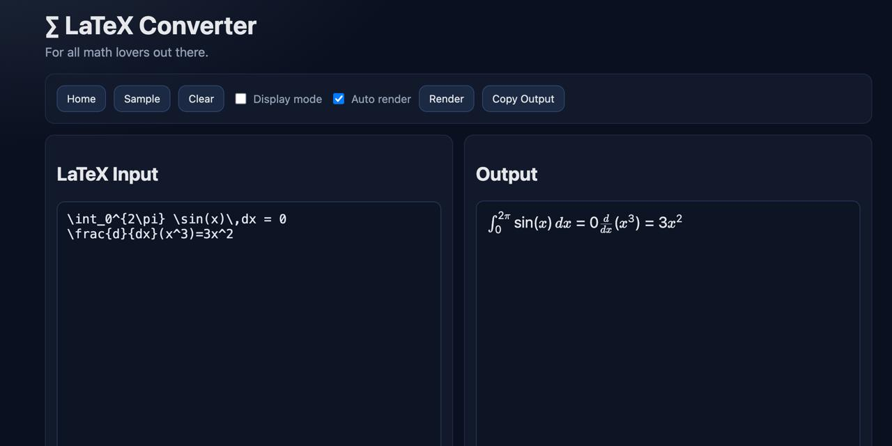

# LaTeX Converter

Status: Active |  Live: https://ek-mc.github.io/latex-converter/

Neat dark LaTeX converter/editor for quick rendering in the browser.

## Features
- Live render
- Display/inline mode toggle
- Auto-render toggle
- LocalStorage persistence
- Dark UI
- Clickable top banner (scroll-to-top)
- Relative favicon path for GitHub Pages compatibility
- Output-side actions: Copy Text, Copy HTML, Download PNG, Download SVG

## Live
- https://ek-mc.github.io/latex-converter/

## Screenshot

## Run locally
Open `index.html`.

## License
MIT

## Changelog
See [CHANGELOG.md](CHANGELOG.md).